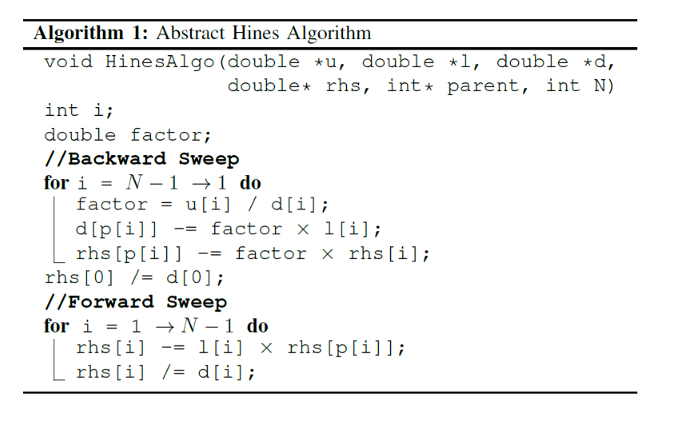
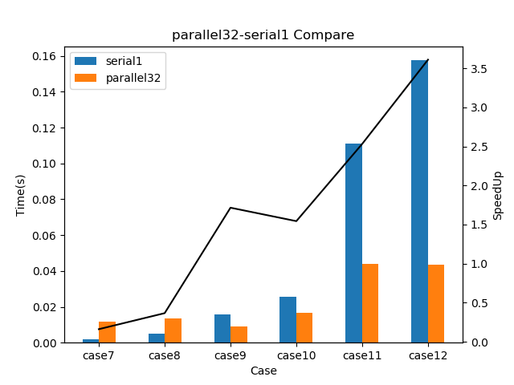
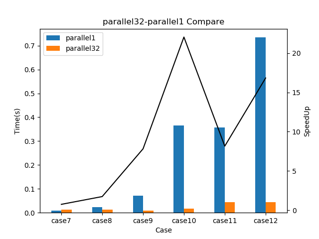

# **并行计算大作业报告**

郭宇祺 1700012785

## 1.问题描述

对于一棵具有N个节点的树T，根节点编号为0，自树根至树叶的编号呈现深度优先次序。每个节点具有以下六种属性(括号内为缩写)：index(id)，upper(l)，diagonal(d)，right-side-hand(rhs)，parent(p)，其中，parent代表的是父节点的id。

该问题包含两个阶段：第一阶段完成由树叶至树根的一次遍历，记作backward sweep；第二阶段完成由树根至树叶的依次遍历，记作forward sweep，两个阶段的次序不可交换。算法伪代码如下：



在本次project中，我选择使用MPI进行编程，性能测试使用提供的服务器进行运行时间的测试。

## 2.问题分析

容易看出，这个算法的主要部分是backward sweep和forward sweep这两个循环。这两个循环相互独立，因此可以对他们做单独分析。下面分别分析这两个循环的内容，并提出对应部分并行代码的构建思路。

### 2.1 backward sweep

首先分析这一个循环的含义。这一段循环代码的含义是显而易见的：每一个节点根据自身的属性值，修改其父节点的属性值。由于节点是按照深度优点访问的次序编号的，因此选择从后往前的遍历顺序总能够使得，在访问编号为x的节点时，x节点的所有子节点已经完成了对x节点属性值的修改，因此此时x节点的属性值已经是最终状态，可以安全地对x节点的父节点的属性值进行更新。

在此理解的基础上，继续对这个循环包含的依赖关系进行分析。根据这段代码的含义，每一个节点必须在其所有的子节点完成对其属性的修改后，才能对父节点的属性进行更新，否则就会导致计算结果出错。这一限制就是这个循环中唯一的数据依赖关系，即节点x的访问需要排在其所有子节点的访问之后。

在串行代码中，循环变量从N-1到1的遍历自动满足了这一数据依赖关系，但是如果选择并行处理，这种数据依赖关系就会成为棘手的问题。在提供的数据结构中，父子节点的连接关系完全存储在子结点中，父节点没有任何关于子节点的信息。因此，如果父子节点被分配到不同的处理器上，父节点因为不知道自己有哪些子节点，因此没有办法知道这些子节点是否已经全部完成了访问，结果，决定何时进行父节点的访问就变成了非常困难的事情。

为了解决这个问题，子节点必须给父节点提供相应的信息，来让父节点明白何时可以安全地进行自身的访问。然而，只有子节点给父节点提供信息仍然不足以使父节点确定自己**所有**的子节点已经完成了访问。父节点每收到一个子节点的信息，只能证明自己的**某一个**子节点完成了访问，不能确定是否还有其他未访问的自己点。因此，必须给父节点预先提供**子节点个数**的信息。这样，结合子节点个数和子节点发来的消息，父节点就能够决定什么时候对自身访问是安全的。

### 2.2 forward sweep

forward sweep显然是与backward sweep顺序相反的一次遍历，在forward sweep中，每一个节点更新自己所有子节点的属性。与backward sweep不同之处在于，每一个节点只有一个父节点，因此在forward sweep中，每一个节点的访问只需置于其父节点的访问之后。这一数据依赖关系比backward sweep的数据依赖关系放松不少。

然而，forward sweep面临新的困难，那就是父节点应该如何通知子节点继续。forward sweep的数据结构与backward sweep完全相同，因此存在相同的问题，那就是父节点不知道哪些节点是自己的子节点，因此没有办法直接通知自己的子节点。而如果采用子节点询问父节点的手段，则会造成大量的无用通讯。因为子节点不知道父节点什么时候会完成访问，只能采取不断轮询的手段，不断向父节点询问，直到父节点返回可以继续的答复，在这一过程中，除了最后一次信息交流是有意义的，之前的所有通讯全部都是无用通讯。树的结构越复杂，节点的数量越多，父节点就绪所需的时间就越长，产生的无用通讯就越多，最后整体效率就越低下。综上所述，直接的父子节点通讯显然是行不通的。

为了解决父子节点通讯的问题，我采取的手段是：父节点广播、子节点扫描。每当父节点就绪，就把自己的信息广播给所有的节点，然后所有节点检查广播信息，确认这条广播信息是否是自身需要的广播信息。如果是，则进行处理，对自身属性值更新，并在处理完成后，广播自身信息，而如果不是，则忽略这一条广播通讯。这一手段虽然不够高效，但也是这种限制下为数不多的选择。

## 3.具体实现

在我的代码中，我对树上的所有节点采用块状的形式进行划分。假设一共有N个节点，P个处理器，则编号为$0至\frac{N}{P}$的节点被分配给0号进程，编号为$\frac{N}{P}至\frac{2N}{P}$的节点被分配给1号进程，以此类推。之所以采用这种划分方式，一方面是由于这是原始论文中推荐的数据划分方式，另一方面，我也尝试使用过其他数据划分方式，但效果都比不上这种数据划分方式。关于其他数据划分方式的讨论，详见short survey，这里就不详细展开了。

下面依次介绍各个步骤。

首先是数据读入。在读入数据文件的阶段，每一个进程都会读取并扫描整个数据文件。在扫描过程中，除了读入当前进程管理的节点所需的数据，还会为每一个管理的节点统计子节点的个数。这一信息可为backward sweep阶段提供方便。

随后是backward sweep阶段。这一段基本按照第二部分所述的思绪进行处理。每个节点在最开始会进行一次初始化扫描，扫描自己管理的所有节点，找出所有叶子节点(子节点个数为0)，进行访问，然后将必要的信息发送给其父节点所在的进程，通讯采用alltoall函数。完成alltoall的通讯后，每个进程扫描自己收到的信息，更新对应父节点的状态，一个父节点每被更新一次，其子节点计数减一，如果完成这次更新后，子节点计数归零，则说明其所有子节点都已完成更新，那么这个父节点就会在下一次通讯时，把它的信息继续发送给其父节点。如此循环，直到所有节点都完成全部的更新。这样就完成了backward sweep。

之后是0号进程对0号节点做单独更新，这一步没有什么可介绍的。

再之后是forward sweep阶段。首先0号进程会对0号节点进行广播，通讯采用allgather函数。之后，每个进程会扫描广播信息，找出对应的子节点进行更新，并在下一次全体广播时把子节点的信息继续广播。如此循环，直到所有节点完成更新。

最后是输出结果。这一部分不是本次project的重点，在此略过不谈。

## 4.进一步优化

在根据第三部分的基本思路完成代码的编写之后，我对代码性能进行了简单测试。测试结果相当令人失望，在服务器上，使用32进程运行的并行版本程序居然比串行版本程序慢了2-3个数量级。这样的结果显然是不能接受的，因此，需要对第三部分提出的实现做进一步优化。

首先我注意到，在我的节点划分策略下，原始的一整棵树被**并列地**划分为p棵子树。这些子树内部有较为复杂的依赖关系，但是子树之间很少存在依赖关系。这在程序运行过程中的表现就是，在每一个进程发出的所有通讯中，大部分通讯的目标仍然是自己进程。因此程序花费了大量的时间，做“自己给自己发信息”这一毫无意义的事情，导致运行时间变慢。因此，优化的第一步就是消除“自己给自己发信息”这一愚蠢的行为。

在原先的设计中，backward sweep和forward sweep的每一次循环都会产生大量的通讯需求，这些通讯需求会在下一次循环中被发送。但是，很多通讯需求其实是发往自身的通讯需求，这些通讯需求完全没有必要被实际发送。因此，在第一步改进中，对于这两个循环，每当产生一个新的通讯需求时，进程会检测这个通讯需求是否是发往自身的。如果是，则直接将其加入todolist，在本次循环中将其完成，而无需令其参与进程间的信息通讯。这一优化使得通讯量大大降低，程序运行时间降低了约2个数量级。

第二步优化是针对forward sweep的优化。在原本的代码中，对于父节点发来的一条信息，进程通过扫描自己管理的所有节点，确定哪几个节点是这个父节点的子节点。这一做法显然相当低效，通常需要扫描几十万的节点才能够找到一个对应的子节点。因此，在改进的代码中，我使用了hashmap存储父节点对应的子节点位置。对于进程收到的每一条信息，进程只需花费O(1)的时间在hashmap中进行查找，即可确定子节点存储的位置。相比原来动辄上万的查询量，这一改进大大提升了forward sweep的运行速度。从效果来看，程序运行时间又降低了1个数量级。

最后一步优化是一些小的trick。在原版的代码中，我使用了STL容器queue。经测试发现，queue的push和pop操作居然占用了程序运行大约一半的时间。因此，我手动实现了一个数组代替queue的功能，来降低运行时间。除此之外，我特别注意优化了代码，减少了相同数据的复制。最终的结果是，程序运行时间降低为原来的三分之一。

## 5.文件编译说明

本次project使用标准cmake流程完成编译、链接过程，即

```
mkdir build
cd build
cmake ..
make
```

在上述操作的make阶段，由于代码中使用了非c++标准库hashmap，因此可能会出现警告甚至编译出错。如出现编译出错，请升级编译器版本或更新库文件(添加GNU_CXX支持)。

完成make后，在build文件夹下会出现名为serial和parallel的可执行文件，使用mpiexec进行运行即可。运行时需要提供两个命令行参数，分别是输入文件名和输出文件名。


## 6.性能测试

本次性能测试均使用ceca19这台机器进行测试，正确性测试只使用case1至case6，性能测试只使用case7至case12。为了公平，修改原始串行版本代码，加入MPI框架的初始化和中止函数，并与并行代码使用相同方式、相同API进行计时，使用-np 1的参数运行。

经比对，serial和parallel对case1至case6的输出完全相同，因此可以认为parallel程序可输出正确结果。

以下是case7至case12运行时间测试结果，单位为秒。以parallel1-II为例，此标签表示使用parallel运行，mpiexec参数为-np 1，执行第二次测试。

| 测试结果       | case7      | case8       | case9      | case10    | case11    | case12    |
| -------------- | ---------- | ----------- | ---------- | --------- | --------- | --------- |
| serial1-I      | 0.00194231 | 0.00498796  | 0.0153005  | 0.0253832 | 0.11062   | 0.157294  |
| serial1-II     | 0.00194311 | 0.0050416   | 0.0158453  | 0.0255809 | 0.110689  | 0.157376  |
| serial1-III    | 0.00190568 | 0.0050292   | 0.0155492  | 0.0257535 | 0.111184  | 0.157824  |
| parallel1-I    | 0.00893998 | 0.0247066   | 0.0710285  | 0.127279  | 0.364048  | 0.755596  |
| parallel1-II   | 0.0089643  | 0.0235157   | 0.0709569  | 0.118718  | 0.361146  | 0.723665  |
| parallel1-III  | 0.00933194 | 0.0236223   | 0.0708838  | 0.118971  | 0.347205  | 0.72394   |
| parallel32-I   | 0.011764   | 0.0127614   | 0.00870252 | 0.0162674 | 0.0437474 | 0.0419853 |
| parallel32-II  | 0.0116265  | 0.0156491   | 0.00911787 | 0.0167685 | 0.043339  | 0.0454156 |
| parallel32-III | 0.0124037  | 0.0126562   | 0.00939417 | 0.0166523 | 0.044234  | 0.0435059 |
| serial1-avg    | 0.00193037 | 0.005019587 | 0.015565   | 0.0255725 | 0.110831  | 0.157498  |
| parallel1-avg  | 0.009078   | 0.0239482   | 0.0709564  | 0.364968  | 0.357466  | 0.734400  |
| parallel32-avg | 0.0119314  | 0.0136889   | 0.00907152 | 0.0165627 | 0.0437735 | 0.0436356 |


将parallel32和serial1的性能比较绘制成图，如下:


容易看出，parallel程序最低运行时间大约在0.01s左右，而serial程序在case7和case8上的总运行时间还远远不到0.01s，因此parallel在这两个case上效果较差。但是，随着case体积增大，节点数目增多，parallel程序越发显现出优势，在case9及之后的case中，parallel程序都拥有超过1的加速比。特别是在节点数量最多的case12上，parallel相比serial运行时间缩短了约4倍，达到了3.5的加速比。根据曲线变化的趋势来看，我有理由相信，随着case的进一步增大，parallel程序能够获得更高的加速效果。

从加速比容易算出，parallel32的并行效率在10%至15%之间，并行效率并不高。不过这主要是由于提供的case中节点数量过少，导致parallel没有办法完全发挥性能。如果能有更大的测试样本，可能parallel能够获得更高的并行效率。

将parallel32和parallel1的性能比较绘制成图，如下:


这一比对主要研究的是parallel程序本身的并行效果。由于对原始算法进行了较大程度的改动，parallel程序实际执行的算法已与serial程序大不相同，因此直接比较parallel32和serial1的性能测试数据可能有些不太公平。这里选择比对parallel32和parallel1，来研究parallel执行算法本身的并行性能。

从图中可以看出，几乎在所有情况下，parallel32的运行时间都远远低于parallel1。除去节点数量过少的case7和case8，parallel32相对parallel1平均能够获得15左右的加速比，并行效率也达到了约50%。这一结果相当令人满意。

## 7.可能的改进空间

本次的代码已经经过精细调整，应该没有太大的改进空间，但是在一些细节上可能留有改进的余地。以下主要列出两处对性能可能有较大影响的部分。

第一处是hashmap。在前面的部分我已经提到，使用STL容器的queue曾严重拖慢了程序的运行速度，将queue替换为自己手动实现的数组后，程序运行时间大幅度缩短。因此我也有理由怀疑，同为STL容器的hashmap是否也存在拖慢程序运行速度的情况。经过测试发现，在case12的情况下，仅hashmap的查找步骤(通过对通信信息的监视，每个进程应该只进行了不超过100次的hashmap查找)，就累计花去了程序运行时间的30%。这一现象看起来似乎不太正常。如果能够自己实现hashmap，或许能够获得更好的性能效果。但是因为hashmap实现过于复杂，因此在本次project中我没有完成这一点的改进。

第二部分是数据通讯。本次我的通讯过程全部直接使用了MPI库提供的通讯函数，从结果上看，似乎通讯效率不高，通讯部份大致占用了程序整体运行时间的50%。如果能够进一步优化进程间通讯，或许也能够进一步提升整体性能。

**以上就是本次报告的全部内容**


